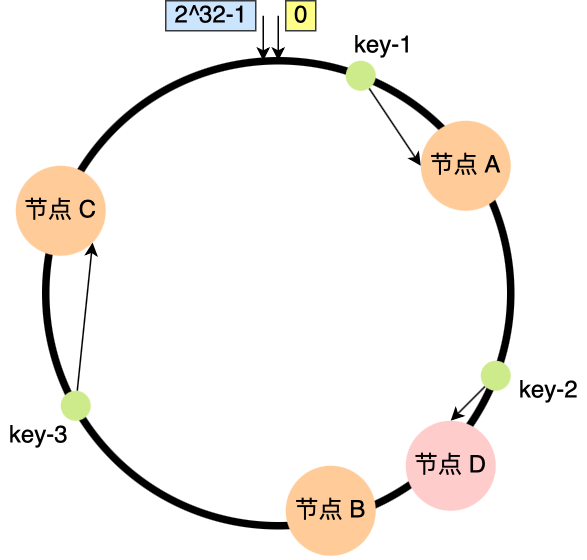
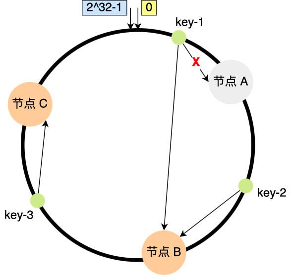
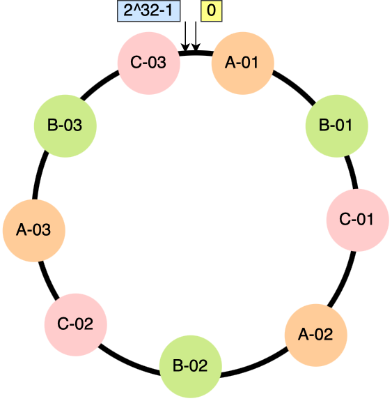
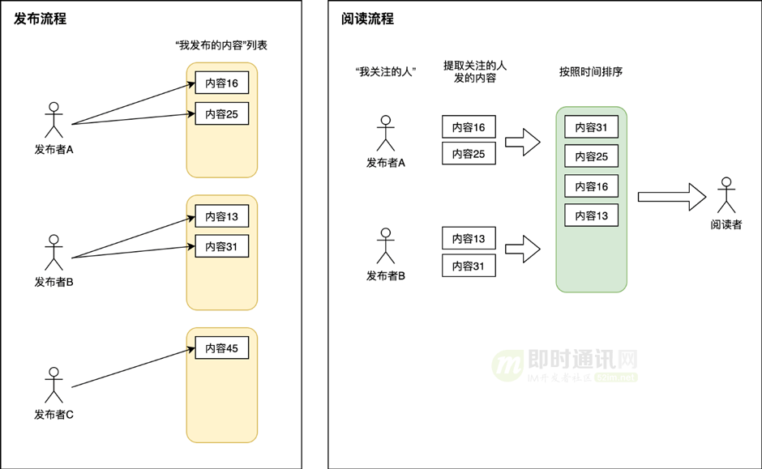
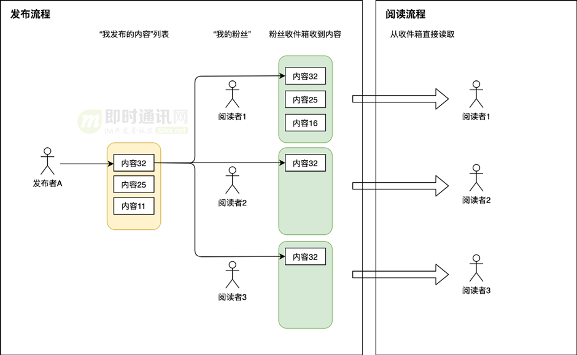
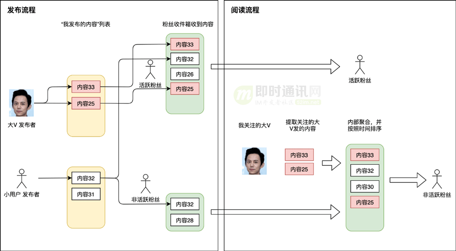
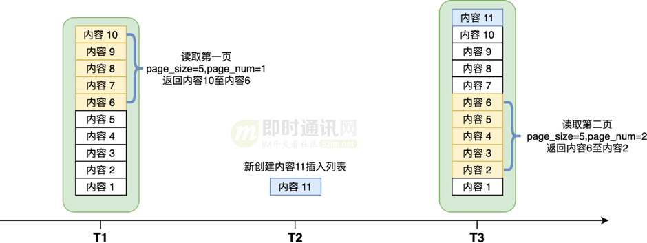
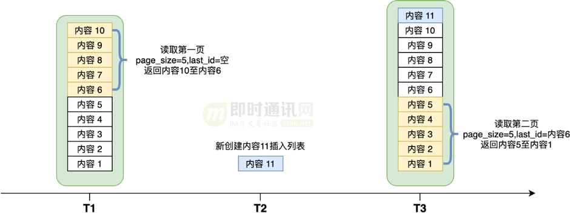

### **实习经历相关问题**  
1. **Excel数据导入校验**  
   - 你在实现Excel数据导入的自动化校验时，如何具体实现格式验证和业务规则校验？异常数据标记（行标红）和错误报告生成的技术细节是什么？  
   
     1. 首先将excel数据读取到内存中,然后对每一条数据进行校验
     2. 格式校验采用hutool工具对用户的身份证号,统一社会信用代码,手机号进行格式校验
     3. 业务规则校验,例如判断黑名单库中是否已经存在当前用户的身份证号以及白名单库中是否存在数据
     4. 如果以上的校验有问题,会将其存入列表中,并标记第几行的数据有错误
     5. 进行错误excel的写出操作(如果校验没问题则直接存入数据库即可),实现`CellWriteHandler`接口重写后处理器,对错误的行进行标红
   
   - 如果用户上传的Excel文件包含百万级数据，如何优化校验性能？是否考虑过分批处理或异步校验？  
   
     1. 使用easyexcel的流式读取模式,例如每次读取1000条之后,将数据暂存到队列中,然后进行校验,然后释放内存
   
        ```java
        // EasyExcel 流式读取示例
        EasyExcel.read(inputStream, DataModel.class, new ReadListener<DataModel>() {
            private List<DataModel> cachedList = new ArrayList<>(BATCH_SIZE);
        
            @Override
            public void invoke(DataModel data, AnalysisContext context) {
                cachedList.add(data);
                if (cachedList.size() >= BATCH_SIZE) {
                    validateAndProcess(cachedList); // 校验并处理批次数据
                    cachedList.clear();
                }
            }
        
            @Override
            public void doAfterAllAnalysed(AnalysisContext context) {
                if (!cachedList.isEmpty()) {
                    validateAndProcess(cachedList); // 处理剩余数据
                }
            }
        }).sheet().doRead();
        
        ```
   
        [基于EasyExcel实现百万级数据导入导出_easyexcel导出百万级数据-CSDN博客](https://blog.csdn.net/qq_44981526/article/details/128738042)
   
2. **Redis分布式缓存**  

   - 黑白名单的分布式缓存机制中，为什么选择Redis而不是其他缓存中间件？在缓存与数据库一致性问题上，你如何确保黑白名单的实时性？  

     1. 其他的缓存中间件我还了解**Memcached**, **Caffeine**, 但是相较于Redis,Memcached无持久化,无集群模式,不支持复杂的数据结构;Caffeine是一个Java本地缓存库,适用于高频访问的小数据缓存,无法跨服务共享缓存
     2. 为什么选择redis?
        1. redis支持复杂的数据结构
        2. redis支持持久化
        3. redis支持哨兵模式,集群模式,可以保证高可用

   - 如果Redis集群出现节点宕机，你的缓存机制如何保证高可用性？是否设计过缓存回源策略？  

     1. 首先是sentinel哨兵模式,通过一主两从的机制以及哨兵机制保证当Redis主节点宕机之后可以迁移到从节点

        1. 哨兵监控master和slave进程是否正常工作,如果主节点或者从节点在规定时间内没有回应哨兵的PING命令,那么哨兵将会把该节点标记为主观下线,一般我们会有3台机器来部署哨兵集群,进行投票判断该节点是否客观下线
        2. 从哨兵集群里面选出来一个leader进行主从切换
        3. 选取哪个从节点呢?通过**优先级、复制进度、ID 号**的指标进行选取

     2. cluster集群用来解决缓存数据量太大的问题

        1. 通过hash槽分配给不同的master节点,达到一个横向扩展的功能
        2. 一般一个cluster集群有3个master和3个slave,master和slave之间做主从复制

     3. 缓存回源策略

        1. 缓存回源策略（Cache Backing Source Strategy）是当缓存中不存在请求的数据时，系统如何从数据源（如数据库、API、文件系统等）获取数据并填充缓存的规则和机制。其核心目标是平衡性能、一致性和资源消耗，确保高并发场景下系统的稳定性和效率。

        > ### **核心策略与实现方式**
        > 1. **被动回源（Lazy Loading / Cache-Aside）**
        >    - **触发条件**：缓存未命中时触发回源。
        >    - **流程**：
        >      1. 应用先查询缓存。
        >      2. 若缓存未命中，从数据源加载数据。
        >      3. 将数据写入缓存后返回结果。
        >    - **优点**：按需加载，节省缓存空间。
        >    - **缺点**：缓存击穿风险（高并发下大量请求穿透到数据源）。
        >
        > 2. **主动回源（预加载 / Refresh-Ahead）**
        >    - **触发条件**：在缓存过期前主动更新数据。
        >    - **流程**：
        >      1. 缓存设置较短的TTL（Time-To-Live）。
        >      2. 后台线程定期或在缓存失效前异步回源更新数据。
        >    - **优点**：减少用户感知的延迟，避免缓存雪崩。
        >    - **缺点**：可能缓存无效数据，增加数据源负载。
        >
        > 3. **并发回源控制**
        >    - **互斥锁（Mutex Lock）**：仅允许一个线程回源，其他线程等待结果（如Redis的`SETNX`）。
        >    - **协程/异步队列**：将回源请求合并或串行化，避免重复查询（如Guava Cache的`LoadingCache`）。
        >
        > 4. **降级与熔断**
        >    - **空值缓存**：对查询不到的Key缓存空值（防止缓存穿透）。
        >    - **熔断机制**：当数据源压力过大时，直接返回默认值或错误，保护后端系统。
        >

3. **AOP日志采集**  

   - 你提到通过AOP统一采集系统访问日志，能否详细说明切面是如何设计的？如何避免AOP对系统性能的显著影响？  

     1. 定义注解用来标记需要记录日志的接口
     2. 通过SPEL表达式记录用户所需要记录日志的模板
     3. 在切面中获取方法的JoinPoint获取到相关参数和返回值等信息写入到mongoDB中
     4. 如何避免AOP对系统性能的显著影响?
        1. 优化切入点表达式: **精确匹配**：避免使用宽泛的通配符（如 `*` 或 `..`），尽量缩小作用范围。
        2. 减少切面逻辑的复杂度: 避免在切面中执行耗时操作（如数据库查询、远程调用）。若必须执行，考虑异步化
        3. 使用编译时织入(AspectJ)避免运行时动态代理的开销。

   - 日志数据量较大时，是否有考虑日志存储和检索的优化方案（如ELK栈）？  

     1. ELK栈是一个由三个开源项目组成的日志管理和数据分析平台，其名称来源于三个核心组件的首字母缩写：**Elasticsearch**、**Logstash** 和 **Kibana**。随着发展，Elastic公司（原Elastic NV）又引入了轻量级数据采集工具 **Beats**，因此现在常被称为 **Elastic Stack**。

        > 1. **Elasticsearch**
        >    - **功能**：分布式搜索和分析引擎，用于存储、检索和分析大规模数据（如日志、指标等）。
        >    - **特点**：支持实时搜索、高可用性、横向扩展，基于倒排索引实现快速查询。
        > 2. **Logstash**
        >    - **功能**：数据收集、转换和传输工具，支持从多种来源（文件、数据库、消息队列等）采集数据，处理后发送到Elasticsearch。
        >    - **特点**：提供丰富的插件（如解析JSON、过滤敏感信息、转换数据格式等）。
        > 3. **Kibana**
        >    - **功能**：数据可视化平台，用于通过图表、仪表盘展示Elasticsearch中的数据。
        >    - **特点**：支持交互式查询、自定义仪表盘、机器学习分析（如异常检测）等。
        > 4. **Beats**（可选扩展）
        >    - **功能**：轻量级数据采集器，专为特定场景设计（如Filebeat收集日志、Metricbeat收集系统指标）。
        >    - **特点**：资源占用低，直接与Elasticsearch或Logstash集成。

     2. 如何使用ELK优化日志存储和检索的优化方案

        1. 

4. **RabbitMQ异步报告生成**  
   - 异步报告生成机制中，消息队列如何保证消息不丢失？如果消费者处理失败，是否有重试或死信队列机制？
     1.  保证消息不丢失有三种解决方案
        1. 发送方采用confirm机制,每次写的消息都会分配一个唯一的id，然后如果写入了rabbitmq之中，rabbitmq会给你回传一个ack消息，告诉你这个消息发送OK了；如果rabbitmq没能处理这个消息，会回调你一个nack接口，告诉你这个消息失败了，你可以进行重试。而且你可以结合这个机制知道自己在内存里维护每个消息的id，如果超过一定时间还没接收到这个消息的回调，那么你可以进行重发。
        2. 针对于RabbitMQ,采用消息持久化机制,集群镜像模式保证高可用
        3. 针对消费者,使用ACK确认机制,服务端关闭自动ack,每次处理完这个消息之后手动ack,重试机制,当消息消费之后之后,根据设置的重试次数在本地进行重试
     2. 该场景下,当消费者消费失败之后,直接丢弃消息即可,后续可由用户手动点击同步生成报告
   - 为什么选择RabbitMQ而非Kafka？  
     1. 支持灵活的 `Exchange-Binding-Queue` 路由机制（Direct/Topic/Headers/Fanout）
     2. 消息到达 Broker 后立即推送给消费者（Push 模式）,Kafka 的 Pull 模式引入额外延迟（适合高吞吐但容忍更高延迟的场景）
     3. 单个队列严格保证 FIFO 顺序
   - 在消息积压的场景下，如何动态调整消费者资源？  
     1. 使用线程池来动态创建线程消费消息

5. **Spring MVC参数解析器重写**  
   - 你提到对Integer、BigDecimal等类型进行容错处理，能否举例说明前端传输非标准数据时的具体场景和解决方案？

     1. 通过拦截器解析HTTP请求并校验参数,适用于需要全局统一处理所有请求的非标准数据（如加密数据、二进制流、自定义格式文本）。希望在请求进入Controller前完成数据解析和校验。

        1. 导致的问题,`HttpServletRequest`的请求体只能读取一次的问题,如何解决?

        ```java
        public class CachedBodyHttpServletRequest extends HttpServletRequestWrapper {
            private final byte[] cachedBody;
            public CachedBodyHttpServletRequest(HttpServletRequest request) throws IOException {
                super(request);
                InputStream inputStream = request.getInputStream();
                this.cachedBody = StreamUtils.copyToByteArray(inputStream);
            }
            @Override
            public ServletInputStream getInputStream() {
                return new CachedBodyServletInputStream(this.cachedBody);
            }
            @Override
            public BufferedReader getReader() {
                ByteArrayInputStream byteArrayInputStream = new ByteArrayInputStream(this.cachedBody);
                return new BufferedReader(new InputStreamReader(byteArrayInputStream));
            }
        }
        ```

        2. 实现过滤器

        ```java
        @Component
        public class CustomDataFilter implements Filter {
            @Override
            public void doFilter(ServletRequest request, ServletResponse response, FilterChain chain) 
                throws IOException, ServletException {
                
                // 包装原始请求
                CachedBodyHttpServletRequest wrappedRequest = 
                    new CachedBodyHttpServletRequest((HttpServletRequest) request);
                
                // 解析请求体中的非标准数据
                byte[] body = wrappedRequest.getCachedBody();
                CustomData customData = parseCustomData(body); // 自定义解析逻辑
                
                // 数据校验
                if (!validate(customData)) {
                    ((HttpServletResponse) response).sendError(HttpStatus.BAD_REQUEST.value(), "Invalid data");
                    return;
                }
                
                // 将解析后的数据存入请求属性，供后续使用
                wrappedRequest.setAttribute("parsedData", customData);
                chain.doFilter(wrappedRequest, response);
            }
        }
        ```

     2. 重写SpringMVC参数解析器（HandlerMethodArgumentResolver）解决

---

### **项目经历相关问题**  
#### **全民点评项目**  
1. **接口防护与限流**  
   - 滑动时间窗口算法如何实现恶意请求拦截？
   
     1. 我们有一个防止刷短信接口的实现,
     2. 我们利用了Redis的Zset数据结构,当用户申请发短信的时候,往key为用户手机号的zset集合中添加一条数据,score分数为当前的时间戳,
     3. 当用户申请发短信的时候,我们会通过当前时间和前一分钟的时间戳统计在此期间用户是否发送短信,如果发送则会返回错误提示用户距离上次发送短信验证码的时间不足1分,
     4. 如果过了1分钟,我们会统计过去5分钟用户发送了多少次短信,如果5分钟内超过5条,我们会添加一个键值对limit:用户的号码,1,并为这个键值对设置一个5分钟的过期时间,
     5. 所以其实流程是这样的,用户发送一个发送短信的请求,我们首先判断其是否被限制,如果被限制,则会返回给用户"5分钟之后再试",
     6. 如果可以通过,则会检查过去1分钟是否发送过验证码,然后会检查过去5分钟是否发送超过5次,如果超过5次则会将其限制5分钟,
     7. 如果这些都过了,则会生成验证码存入redis,设置一个2分钟的过期时间,然后将发送验证码的时间存入zset中,
     8. 当然为了**保证原子性**这都是在Lua脚本里面实现的
   
   - 相比令牌桶或漏桶算法，滑动窗口的优缺点是什么？  
   
     | **算法**     | **核心原理**                                                 | **优点**                           | **缺点**                                               | **典型应用场景**                           |
     | ------------ | ------------------------------------------------------------ | ---------------------------------- | ------------------------------------------------------ | ------------------------------------------ |
     | **固定窗口** | 固定时间窗口（如1分钟）内计数，超限拒绝请求，窗口重置时清零计数器 | ✅ 实现简单<br>✅ 内存消耗低         | ⚠️ 窗口切换时流量突增（临界问题）<br>⚠️ 无法应对短时突发 | 简单限流场景<br>短信验证码防刷             |
     | **滑动窗口** | 将时间划分为细粒度子窗口（如10秒/格），统计最近N个子窗口的总请求数 | ✅ 缓解临界问题<br>✅ 精度可调节     | ⚠️ 计算复杂度较高<br>⚠️ 子窗口粒度影响效果               | API网关限流<br>需要平衡精度和性能的场景    |
     | **令牌桶**   | 以恒定速率生成令牌，请求需获取令牌，无令牌时拒绝（允许消耗积累的突发令牌） | ✅ 允许突发流量<br>✅ 平滑过渡到限速 | ⚠️ 突发可能压垮下游<br>⚠️ 需维护令牌状态                 | 秒杀系统<br>弹性伸缩的微服务               |
     | **漏桶**     | 请求以任意速率进入桶，以固定速率流出，桶满时拒绝（强制恒定输出速率） | ✅ 严格流量整形<br>✅ 保护下游系统   | ⚠️ 无法利用系统空闲资源<br>⚠️ 增加请求延迟               | 视频流控速<br>金融交易系统（稳定处理需求） |
   
     | 维度         | 滑动时间窗口                      | 令牌桶算法                           | 漏桶算法                                |
     | ------------ | --------------------------------- | ------------------------------------ | --------------------------------------- |
     | **核心原理** | 统计指定时间窗口内的实际请求量    | 以恒定速率生成令牌，请求消耗令牌     | 以恒定速率处理请求，超出速率则排队/拒绝 |
     | **时间精度** | 精确到毫秒级的时间窗口控制        | 依赖令牌生成间隔精度                 | 依赖漏出速率设置                        |
     | **数据结构** | 需要存储每个请求的时间戳（ZSET）  | 维护令牌计数+最后刷新时间            | 维护队列或计数器                        |
     | **突发处理** | 严格限制窗口内总量，无突发允许    | 允许突发（消耗积累的令牌）           | 完全平滑流量，无突发                    |
     | **内存消耗** | O(N)（N为窗口内请求数）           | O(1)（仅存储计数）                   | O(M)（M为队列容量）                     |
     | **适用场景** | 精确次数限制（如API调用次数控制） | 允许突发的速率限制（如网络流量控制） | 流量整形（保护下游服务）                |
   
     如何实现? [基于Redis限流（固定窗口、滑动窗口、漏桶、令牌桶）（肝货！！！）_redis 漏桶-CSDN博客](https://blog.csdn.net/weixin_43316702/article/details/136259307)
   
   - 为什么短信接口限流
   
     1. ZSET的score存储时间戳天然适合时间窗口计算
     2. 漏桶算法无法直接统计历史请求次数
     3. 令牌桶算法不适用于精确次数限制场景
   
   - 分布式限流中，Redis令牌桶的原子化操作如何实现？
   
     LUA脚本实现
   
   - 是否遇到过Redis性能瓶颈？  
   
     > 1. 内存限制：
     >    性能瓶颈：Redis是一个基于内存的数据库，当数据量大于可用内存时，会导致性能下降或服务不可用。
     >    解决方法：增加服务器的内存容量，使用更高配置的服务器，或者采用数据分片（Sharding）的方式，将数据分散到多个Redis实例中，从而扩展总内存。
     >
     > 2. 单线程模型：
     >    性能瓶颈：Redis默认采用单线程模型，对于某些计算密集型操作或大规模数据处理，可能会导致单线程的CPU利用率不高。
     >    解决方法：使用Redis Cluster来分片数据并实现水平扩展，或者通过将某些计算操作转移到其他组件（如数据库或后台任务）来减轻Redis的负担。
     >
     > 3. 网络延迟：
     >    性能瓶颈：网络延迟会影响Redis的响应时间，特别是对于远程客户端。
     >    解决方法：将Redis部署在与客户端尽可能近的地方，减少网络延迟；优化网络拓扑和设置合理的网络缓冲区大小。
     >
     > 4. 频繁的持久化操作：
     >    性能瓶颈：频繁的持久化操作（RDB快照或AOF写操作）可能导致Redis的性能下降。
     >    解决方法：调整持久化策略，根据业务需求设置合理的持久化间隔，可以选择更频繁地进行RDB持久化，而较少使用AOF持久化。
     >
     > 5. 复杂数据结构操作：
     >    性能瓶颈：复杂数据结构操作（如集合、有序集合的交集、并集运算等）可能会导致较高的CPU消耗。
     >    解决方法：对于复杂数据结构操作，可以考虑在应用层实现或使用Redis提供的异步操作来降低对Redis主线程的影响。
     >
     > 6. 冷启动：
     >    性能瓶颈：当Redis实例在重启后，可能会经历一个冷启动阶段，此时需要重新加载数据，导致请求响应较慢。
     >    解决方法：使用Redis的持久化机制来避免数据丢失，同时考虑采用高可用性方案，如Redis Sentinel或Redis Cluster，确保故障转移时的数据可用性。
     >
     > 7. 频繁的数据过期和删除：
     >    性能瓶颈：频繁的数据过期和删除操作可能导致Redis的内存碎片化。
     >    解决方法：合理设置过期时间，避免过多的瞬时删除操作，同时可以使用内存淘汰策略，如LRU（最近最少使用）来优化内存使用。
   
2. **优惠券秒杀与库存问题**  
   - 通过CAS解决库存超卖问题时，如何避免ABA问题？
   
     版本号解决
   
   - 在高并发场景下，CAS的性能是否成为瓶颈？  
   
     是的,后面将库存的判断放到redis中
   
   - Redis+Lua脚本解决“一人一单”时，Lua脚本是如何保证原子性的？
   
     Redis 使用单线程处理命令，所有客户端请求在核心线程中串行执行。当 Lua 脚本被 Redis 执行时,整个脚本会被视为一个独立的执行单元,脚本执行期间，Redis 不会处理其他客户端请求,脚本中的多个 Redis 命令不会被其他操作打断
   
   - 是否测试过脚本的执行效率？  
   
3. **缓存一致性方案**  
   - 延迟双删的具体实现步骤是什么？如果第二次删除失败，如何保证最终一致性？  
   - 缓存雪崩问题中，随机TTL的取值范围如何设定？是否结合了热点数据预加载？ 
   - 在高并发场景下，如何结合布隆过滤器与本地缓存解决缓存穿透？
   - 分片集群中如何同步布隆过滤器的状态? 
   
4. **秒杀性能优化**  
   - 异步化订单处理引擎中，如何保证消息队列的顺序性？
   - 如果RabbitMQ集群宕机，是否有降级方案？  
   - 逻辑过期解决缓存击穿时，如何触发缓存重建？是否有防止多个线程同时重建的机制？  
   - 布隆过滤器解决缓存穿透问题,如何同步Redis集群节点的布隆过滤器状态呢?或者有其他解决办法吗?
     1. 实际上我们只需要让不同的节点负责不同的数据即可,通过文章的id进行路由,检查路由到的节点的布隆过滤器状态即可
   - 引申一下,如果想要同步不同节点的某一个数据的状态,应该如何实现呢?
     1. 
   - 布隆过滤器的缺点?
     1. 布隆过滤器不能够完全反映数据是否一定存在数据库中,如果判断没有,则肯定不存在,而由于hash碰撞的产生,判断当前有数据就不能判断当前数据是否真正存在数据库中了
     2. 布隆过滤器的数据只能插入,不能删除,同样是因为hash碰撞导致的,如果删除了一个A的二进制数据,可能会导致B的二进制数据也被删除
   
5. **redis 分片集群**
   
   - 看到你说搭建 redis 分片集群，你是如何搭建的？

     > ### 整体概念引入
     >
     > 在开始搭建 Redis 分片集群之前，需要先简要介绍一下 Redis 分片集群的概念和作用。
     >
     > “Redis 分片集群是一种将数据分散存储在多个 Redis 节点上的架构，通过分片可以突破单个 Redis 实例的内存限制，提高系统的读写性能和可扩展性。每个节点负责存储部分数据，客户端可以根据特定的规则将请求路由到对应的节点上。”
     >
     > ### 搭建前的准备
     >
     > - 硬件与软件环境
     >   - “首先要准备好多台服务器或者虚拟机，建议每台服务器具有足够的 CPU、内存和磁盘空间。操作系统可以选择常见的 Linux 发行版，如 CentOS 或 Ubuntu。同时，需要在每台服务器上安装 Redis 软件，确保版本一致，推荐使用较新的稳定版本。”
     > - 规划节点与端口
     >   - “规划好集群中的节点数量和角色，一般来说，一个 Redis 分片集群至少需要 6 个节点（3 个主节点和 3 个从节点）。为每个节点分配唯一的 IP 地址和端口号，例如，主节点可以使用 7000 - 7002 端口，从节点使用 7003 - 7005 端口。”
     >
     > ### 搭建步骤
     >
     > #### 1. 配置 Redis 节点
     >
     > - “在每台服务器上修改 Redis 配置文件（通常是 redis.conf），进行以下关键配置：
     >   - **开启集群模式**：将 `cluster-enabled yes` 这一行的注释去掉，开启 Redis 集群功能。
     >   - **设置集群配置文件**：指定集群配置文件的名称，如 `cluster-config-file nodes.conf`。
     >   - **设置节点超时时间**：通过 `cluster-node-timeout 15000` 设置节点超时时间为 15 秒。
     >   - **绑定 IP 地址**：将 `bind` 配置项设置为服务器的实际 IP 地址，确保节点可以被其他节点访问。
     >   - **修改端口号**：根据之前的规划，修改 `port` 配置项为相应的端口号。”
     >
     > #### 2. 启动 Redis 节点
     >
     > ```bash
     > redis-server /path/to/redis.conf
     > ```
     >
     > 这里的 `/path/to/redis.conf` 是你实际的 Redis 配置文件路径。启动后，可以使用 `redis-cli -p <port> ping` 命令来验证节点是否正常运行，其中 `<port>` 是节点的端口号。”
     >
     > #### 3. 创建集群
     >
     > ```bash
     > redis-cli --cluster create <ip1>:<port1> <ip2>:<port2> ... <ip6>:<port6> --cluster-replicas 1
     > ```
     >
     > 其中，`<ip1>:<port1>` 到 `<ip6>:<port6>` 是之前规划好的 6 个节点的地址和端口号。`--cluster-replicas 1` 表示每个主节点有一个从节点。执行命令后，Redis 会自动分配槽位，并将节点组成一个集群。”
     >
     > ### 验证与测试
     >
     > - 验证集群状态
     >
     > ```bash
     > redis-cli -c -h <ip> -p <port> cluster info
     > ```
     >
     > 其中，`<ip>` 和 `<port>` 是任意一个节点的地址和端口号。`-c` 选项表示开启集群模式。如果集群状态显示为 `ok`，则说明集群创建成功。”
     >
     > - 测试数据读写
     >
     > ```bash
     > redis-cli -c -h <ip> -p <port>
     > set key value
     > get key
     > ```
     >
     > 如果可以正常读写数据，并且在不同节点上都能获取到正确的数据，说明集群可以正常工作。”
     >
     > ### 后续维护
     >
     > - “在集群搭建完成后，还需要进行一些后续的维护工作，如监控节点的状态、定期备份数据、处理节点故障等。可以使用 Redis 自带的监控命令或者第三方监控工具来监控节点的 CPU、内存、网络等指标。同时，要制定合理的数据备份策略，确保数据的安全性。”
     >
     > 通过以上步骤和解释，你可以向面试官清晰地阐述如何搭建 Redis 分片集群，展示你对 Redis 集群的理解和实践能力。
   
   - 介绍下redis 分片集群的实现原理，以及如何解决数据倾斜问题
   
     1. 常见的数据分区规则有三种,节点取余分区,一致性哈希分区,虚拟槽分区
   
        1. 节点取余分区是一种简单的分区策略，其中数据项通过对某个值（通常是键的哈希值）进行取余操作来分配到不同的节点。但是当需要进行扩容或者缩容的时候,需要重新计算数据存放的位置,**最坏情况下所有数据都需要迁移，所以它的数据迁移规模是 O(M)，这样数据的迁移成本太高了。**
   
        2. 一致性hash算法是对2^32进行取模运算,对存储节点进行hash计算,对数据进行hash,将节点和数据都映射到一个首尾相连的hash环上面了,当数据进行hash操作之后,在hash环上面通过顺时针方向找到的第一个节点,就是存储该数据的节点
   
           1. 当进行扩容的时候,你可以看到，key-01、key-03 都不受影响，只有 key-02 需要被迁移节点 D。
   
              
   
           2. 当你进行缩容的时候,你可以看到，key-02 和 key-03 不会受到影响，只有 key-01 需要被迁移节点 B。
   
              
   
           3. 但是这样可能也会产生数据倾斜问题,那么我们可以引入虚拟节点来解决
   
              
   
        3. Redis Cluster 有 16384 个哈希槽，每个键根据其名字的 CRC16 值被映射到这些哈希槽上。然后，这些哈希槽会被均匀地分配到所有的 Redis 实例上。这种分区可以灵活地将槽（以及槽中的数据）从一个节点迁移到另一个节点，从而实现平滑扩容和缩容；数据分布也更加均匀
           1. 当某一个节点宕机之后,仅需将分配在该节点上面的插槽重新分配即可
           2. 如果进行扩容,则只需要将一些槽分配到新增的节点即可
   
     2. 如何寻找到正确的节点?
   
        1. 客户端首次连接集群时，会从任意节点获取完整的 **槽位-节点映射表**（例如通过 `CLUSTER SLOTS` 命令）。
        2. 客户端缓存此映射表，后续请求直接根据 `key` 计算槽号，并找到对应的节点。
   
     3. 如何解决数据倾斜问题,导致数据倾斜的原因有:**bigkey**,**Slot分配不均衡**,**HashTag导致数据倾斜**
   
        1. bigKey倾斜: 将一个key拆分为多个key,使用ulink删除bigkey,通过`redis-cli --bigkeys`查询bigKey
        2. slot分配句均衡: 手动迁移,讲一个比较大的slot迁移到稍微空闲的节点上面
        3. HashTag使用不当: 避免在Key名称中使用`{}`。如需在Key名称中使用`{}`，需保证`{}`中的内容尽可能不同，从而使Key尽量均匀地分布在集群的不同数据分片节点上。
   
6. **Feed流推送**
   - 看你用 redis 的 SortedSet 实现了 Feed 流推送，具体怎么做的？
   
     1. 我们把时间戳作为zset的分数,然后使用zrange获取最新的博文
     2. `stringRedisTemplate.opsForZSet().reverseRangeByScoreWithScores(key, 0, max, offset, 2);`
     3. 我们从最大的分数开始查,比如查4条,然后其score分数为1000,那么下次查询我只需要从比1000小的分数里面查询即可
     4. 但是这仍然会产生问题,比如我们查询到score的最小值是1000,那么下次我们需要拿着这个1000当做最大值去查询,那么如果1000在set中重复的话就会出现问题
     5. 我们可以使用offset解决这个问题,获取到当前获取到的数据的最后面的score值,如果没有重复的话,我们给一个偏移量1,如果有重复那么就给偏移量为重复次数
   
   - 朋友圈也是一种 feed 流的实现对吧，用户A发布朋友圈后，然后 A 的好朋友都能看见，你能说说看她可能的实现原理嘛？
   
     1. 采用拉模式实现
   
        
   
        1. 每一个内容发布者都有一个自己的发件箱（“我发布的内容”），每当我们发出一个新帖子，都存入自己的发件箱中。当我们的粉丝来阅读时，系统首先需要拿到粉丝关注的所有人，然后遍历所有发布者的发件箱，取出他们所发布的帖子，然后依据发布时间排序，展示给阅读者。
   
        2. 阅读者读一次Feed流，后台会扩散为N次读操作（N等于关注的人数）以及一次聚合操作，因此称为读扩散。每次读Feed流相当于去关注者的收件箱主动拉取帖子，因此也得名——**拉模式**。
        3. 底层存储简单,没有空间浪费,但是每次读操作都非常重,操作非常多
   
     2. 采用推模式
   
        
   
        1. 系统中每个用户除了有发件箱，也会有自己的收件箱。当发布者发表一篇帖子的时候，除了往自己发件箱记录一下之外，还会遍历发布者的所有粉丝，往这些粉丝的收件箱也投放一份相同内容。这样阅读者来读Feed流时，直接从自己的收件箱读取即可。
        2. **这种设计：**每次发表帖子，都会扩散为M次写操作（M等于自己的粉丝数），因此成为**写扩散**。每篇帖子都会主动推送到所有粉丝的收件箱，因此也得名**推模式**。
        3. **这种模式可想而知：**发一篇帖子，背后会涉及到很多次的写操作。通常为了发帖人的用户体验，当发布的帖子写到自己发件箱时，就可以返回发布成功。后台另外起一个异步任务，不慌不忙地往粉丝收件箱投递帖子即可。
        4. 写扩散的好处在于通过数据冗余（一篇帖子会被存储M份副本），提升了阅读者的用户体验。通常适当的数据冗余不是什么问题，但是到了微博明星这里，完全行不通。比如目前微博粉丝量Top2的谢娜与何炅，两个人微博粉丝过亿。
   
   - 如果回答的比较好，接着问以下问题：如果明星发朋友圈呢，可能会有5000个，也要遍历嘛？（回答到异步 消息队列比较好），分级推送？
   
     1. 采用读写混合模式
   
        
   
        
   
        1. 当何炅这种粉丝量超大的人发帖时，将帖子写入何炅的发件箱，另外提取出来何炅粉丝当中比较活跃的那一批（这已经可以筛掉大部分了），将何炅的帖子写入他们的收件箱。当一个粉丝量很小的路人甲发帖时，采用写扩散方式，遍历他的所有粉丝并将帖子写入粉丝收件箱。
        2. **对于那些活跃用户登录刷Feed流时：**他直接从自己的收件箱读取帖子即可，保证了活跃用户的体验。
        3. **当一个非活跃的用户突然登录刷Feed流时：**一方面需要读他的收件箱；另一面需要遍历他所关注的大V用户的发件箱提取帖子，并且做一下聚合展示。
   
   - Feed流中的分页问题
   
     问题:
   
     
   
     1. 在T1时刻读取了第一页，T2时刻有人新发表了“内容11”，在T3时刻如果来拉取第二页，会导致错位出现，“内容6”在第一页和第二页都被返回了。事实上，但凡两页之间出现内容的添加或删除，都会导致错位问题。
     2. **为了解决这一问题：**通常Feed流的分页入参不会使用page_size和page_num，而是使用last_id来记录上一页最后一条内容的id。前端读取下一页的时候，必须将last_id作为入参，后台直接找到last_id对应数据，再往后偏移page_size条数据，返回给前端，这样就避免了错位问题。
   
     
   
     在本项目中就是使用SortedSet实现的
   
   - 活跃用户和非活跃用户，如果让你设计，你会怎么做？会不会区分这两种用户，做冷热数据分层。
   
     参考上面读写混合模式
   
   [IM开发技术学习：揭秘微信朋友圈这种信息推流背后的系统设计-IM开发/专项技术区 - 即时通讯开发者社区!](http://www.52im.net/thread-3675-1-1.html)
   
7. **超时订单取消**
   
   - 你是如何通过 rabbitMQ 实现超时订单取消，你具体怎么做的？
     1. 延迟队列取消超时订单,消费者方接收到数据之后,需要判断当前的订单状态,如果是未支付则取消订单,如果是已支付则不取消订单
   - 消息是怎么流转的，生产者 -> 消费者
     1. 生产者: 当生产者判断用户有下单资格之后,会发送一条消息到MQ中
     2. 消费者: 消费者监听死信队列,如果收到消息则对相应的订单进行取消操作
   - 如果在取消时间之前，用户支付了订单。那这条消息还是会被消费者读到，此时该订单还会被取消吗？你怎么做的？
     1. 不会,因为消费方在消费消息的时候会判断当前订单的状态,如果是未支付则取消订单,如果是已支付则不取消订单
   
8. **高并发问题**
   - 使用Redis对高频访问的信息进行缓存预热，你如何判断哪些信息是高频的？
     1. 解析Nginx/Access Log中的URL请求频率
     2. 分析API网关的调用统计（如QPS、响应时间）
     3. 记录各业务接口的实时调用量
     4. Redis内置命令: `redis-cli --hotkeys`查询hotkey,`redis-cli INFO stats | grep total_commands_processed`监控实时命令统计
   - 解决缓存雪崩问题,随机TTL怎么设置,设置一个什么范围的值?
   - 简单介绍下缓存击穿，缓存穿透，缓存雪崩的区别吧。
   
    缓存击穿、缓存穿透和缓存雪崩是缓存系统中常见的三大问题，其核心区别体现在**触发场景**、**数据状态**和**影响范围**上。以下是具体对比分析：
   
   ---
   
    ### 一、核心定义与触发场景
    | **问题类型**   | **核心定义**                                                                 | **典型触发场景**                                                                 |
    |----------------|----------------------------------------------------------------------------|--------------------------------------------------------------------------------|
    | **缓存击穿**   | 热点数据缓存失效时，大量并发请求直接冲击数据库                        | - 秒杀商品缓存过期<br>- 突发新闻热点Key失效                            |
    | **缓存穿透**   | 查询不存在的数据（缓存和数据库均无），导致无效请求穿透到数据库          | - 恶意攻击（如随机ID扫描）<br>- 参数校验缺失（如负数ID请求）             |
    | **缓存雪崩**   | 大量缓存同时失效或缓存服务宕机，导致数据库瞬时过载                   | - 缓存集群重启<br>- 批量设置相同过期时间（如系统初始化缓存）            |
   
   ---
   
    ### 二、数据状态与影响范围
    | **维度**       | **缓存击穿**                               | **缓存穿透**                               | **缓存雪崩**                               |
    |----------------|-------------------------------------------|-------------------------------------------|-------------------------------------------|
    | **数据存在性** | 数据库存在该数据，但缓存失效       | 缓存和数据库均不存在该数据          | 缓存失效的数据可能存在于数据库     |
    | **影响范围**   | 单个热点Key（如促销商品ID）        | 可能涉及大量无效Key（如随机攻击）  | 全局性影响（如全站缓存失效）      |
    | **请求特征**   | 高并发针对同一Key                  | 分散的无效Key请求                  | 大量不同Key的并发请求              |
   
   ---
   
    ### 三、解决方案对比
    | **解决方案**            | **缓存击穿**                                                                 | **缓存穿透**                                                                 | **缓存雪崩**                                                                 |
    |-------------------------|----------------------------------------------------------------------------|----------------------------------------------------------------------------|----------------------------------------------------------------------------|
    | **核心思路**            | 防止热点数据失效时的高并发穿透                                             | 拦截无效请求并减少数据库压力                                               | 分散缓存失效风险，降低数据库瞬时负载                                       |
    | **常用技术手段**         | - 互斥锁/分布式锁（仅单线程重建缓存）<br>- 逻辑过期（后台异步更新） | - 布隆过滤器拦截非法Key<br>- 缓存空值（如NULL，短TTL）      | - 随机过期时间（避免集中失效）<br>- 多级缓存（Redis+本地缓存） |
    | **补充策略**            | 设置热点数据永不过期（需配合异步更新）                             | 参数合法性校验（如ID范围过滤）                                      | 熔断降级（如限流返回默认值）                                      |
   
   ---

    ### 四、记忆技巧与类比
    • **缓存击穿** ➜ "定点爆破"：单个热点Key失效引发集中火力攻击数据库  
    • **缓存穿透** ➜ "无中生有"：请求本不存在的数据，如同攻击空气  
    • **缓存雪崩** ➜ "天崩地裂"：大规模缓存失效导致系统性崩溃
   
   ---
   
    ### 五、生产环境综合建议
    1. **组合防御**：  
    • 布隆过滤器+参数校验拦截穿透  
       • 分布式锁+异步更新应对击穿  
       • 多级缓存+随机TTL预防雪崩  
    2. **监控与熔断**：  
    • 实时监控缓存命中率与数据库QPS  
       • 触发阈值时启动限流或返回兜底数据  
    3. **容灾设计**：  
    • 冷热数据分离（如Redis+MySQL归档）  
       • 缓存集群高可用（哨兵模式/Cluster）

